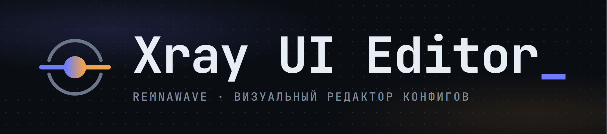
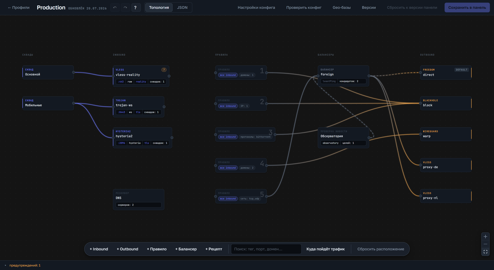
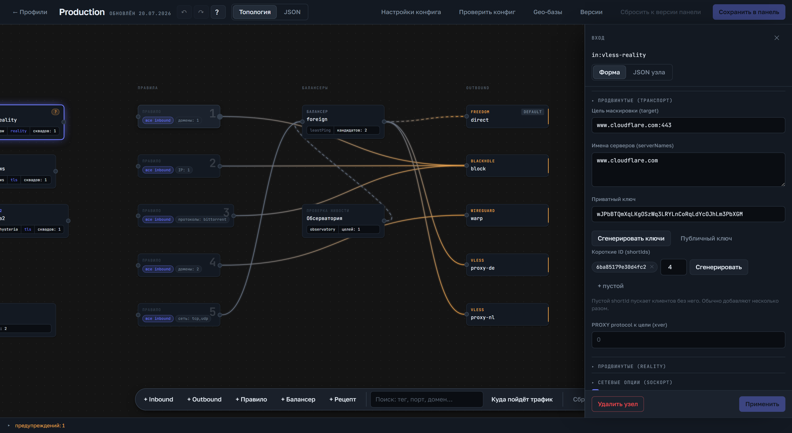
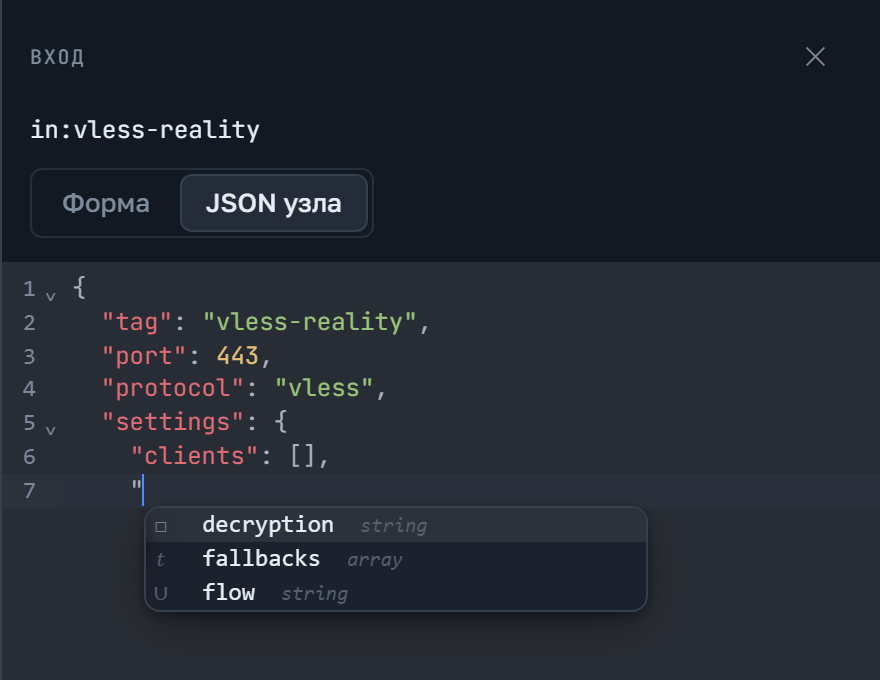
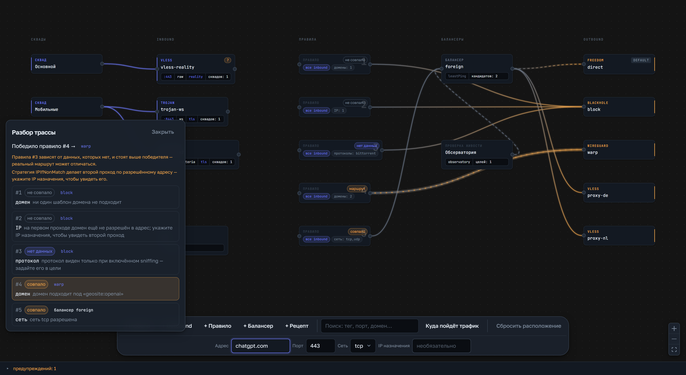
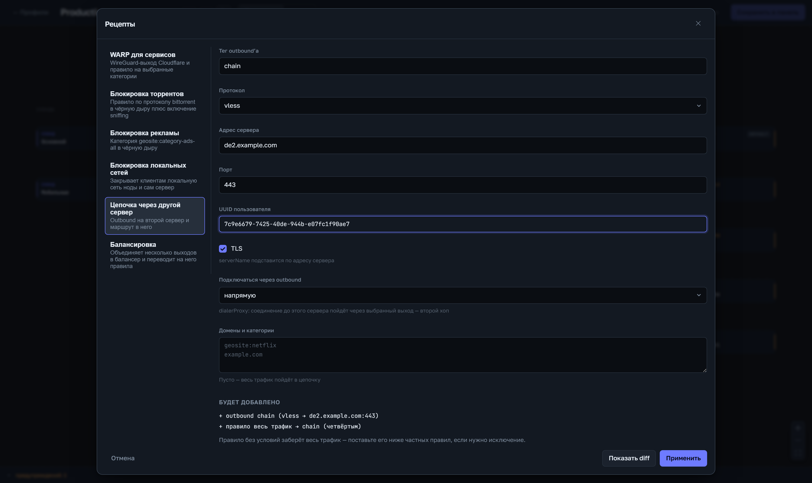

<div align="center">

<picture>
  <source media="(prefers-color-scheme: dark)" srcset="docs/brand/logo.png" />
  <source media="(prefers-color-scheme: light)" srcset="docs/brand/logo-light.png" />
  
</picture>

**Визуальный редактор Xray-конфигов для панели [Remnawave](https://docs.rw) — топология трафика графом, формы вместо ручного JSON, сохранение прямо в панель по API.**

[](https://github.com/VAQYBIN/Remnawave-Xray-UI-Editor/releases)
[](./LICENSE)




</div>

> [!NOTE]
> **Дисклеймер.** Проект создан исключительно в **образовательных и исследовательских целях** —
> как демонстрация работы с API панели Remnawave и структурой Xray-конфигов. Автор **не несёт
> никакой ответственности** за использование этого программного обеспечения, любые последствия
> его применения и за действия пользователей. Вы используете его **на свой собственный риск** и
> обязаны соблюдать законодательство своей юрисдикции. Софт поставляется «как есть», без каких-либо
> гарантий (см. [LICENSE](./LICENSE)).

> [!NOTE]
> Редактор работает и с панелью 2.8.x, и с 3.x: используемые им ручки `config-profiles`,
> `internal-squads` и `nodes` мажор не менял. Единственное расхождение — ответ на удаление
> профиля (`204` против `200`), и оно обработано.

---

Xray-конфиг — это большой вложенный JSON: inbound'ы, outbound'ы, транспорты, TLS/Reality,
правила маршрутизации, DNS. Редактировать его руками легко ошибиться. Этот редактор
показывает конфиг **графом трафика** (squad → inbound → правило → outbound), даёт **формы**
на каждый узел и **проверяет целостность** до сохранения в панель.

## ✨ Возможности

- **Топология графом.** Конфиг рисуется колоночным графом (React Flow): видно, какой inbound
  куда маршрутизируется, какие правила и outbound'ы задействованы. Узлы перетаскиваются,
  кабели создаются и удаляются мышью. Коммутируется всё: inbound → правило, правило →
  outbound, а inbound → outbound создаёт правило сам. Кабель окрашен градиентом от цвета
  источника к цвету приёмника, выбранный узел подсвечивает весь свой путь трафика.
- **Формы вместо JSON — полное покрытие:**
  - **Inbound:** VLESS (fallbacks, decryption, flow), Trojan (fallbacks), Shadowsocks
    (method/network), **Hysteria 2**; полный sniffing (destOverride / routeOnly / metadataOnly).
  - **Outbound:** freedom (redirect, fragment с анти-DPI пресетом `tlshello`), blackhole,
    wireguard/WARP (несколько peers, reserved), vless-цепочки (vnext), socks/http,
    mux + sendThrough.
  - **Транспорты:** TCP(raw), WebSocket, gRPC, HTTPUpgrade, XHTTP, Hysteria — со всеми полями.
  - **TLS целиком:** ALPN, fingerprint, сертификаты (файловые пути / inline-PEM), версии,
    rejectUnknownSni.
  - **Reality целиком** с разведением серверных/клиентских полей и **генератором ключей**
    (приватный/публичный ключ, short-ID) прямо в форме.

  
- **Маршрутизация формой.** Полный редактор правила: домены/IP/порты/сеть/протокол со
  шпаргалкой префиксов (`geosite:` / `geoip:` / `domain:` / `regexp:`), перестановка правил,
  глобальный диалог «Настройки конфига» (`domainStrategy`, `domainMatcher`, `log`).
- **DNS формой.** Серверы (строкой или расширенным объектом с `domains`/`expectIPs`), `hosts`,
  `queryStrategy`, `tag`.
- **Умная валидация.** Проверяет несовместимые комбинации транспорт × security (Reality только
  поверх raw/xhttp/grpc), flow × транспорт, Hysteria без сертификата, висячие ссылки на
  несуществующие теги, домены без префикса, битые порты — и подсвечивает до сохранения.
- **Навигация по проблемам.** Ошибка подчёркивает своё место в JSON, а клик по ней в статус-баре
  ведёт к узлу графа (на вкладке «Топология») или к нужной строке (на вкладке JSON). Узлы с
  проблемами помечены значком. Рядом — поиск по тегам, портам, доменам и правилам с
  центрированием на найденном узле.
- **Безопасность правок.** Отмена и возврат на 50 шагов, горячие клавиши, выгрузка и загрузка
  конфига файлом, сравнение любого бэкапа с текущим черновиком.
- **Матрица совместимости в формах.** Несовместимые опции просто не предлагаются в select'ах;
  уже существующие в конфиге — подсвечиваются предупреждением, но никогда не переписываются молча.
- **Диагностика конфига.** Трассировщик отвечает, куда на самом деле уйдёт трафик по заданному
  адресу (какое правило победит и почему), проверка ядром прогоняет документ через настоящий
  `xray run -test`, а проба Reality-цели говорит, годится ли выбранный сайт под маскировку.
  Подробнее — [ниже](#-диагностика-конфига).
- **Оптимистическая блокировка + бэкапы.** Перед каждым сохранением текущая версия уходит в
  бэкап; при расхождении версий — понятный конфликт-диалог, а не молчаливая перезапись.
- **Пресеты профилей.** Типовые связки inbound/outbound (минимальный VLESS, VLESS Reality
  Vision с автогенерацией ключей) — без ручного набора JSON.
- **Рецепты.** WARP для выбранных сервисов, блокировка торрентов и рекламы, защита локальной сети
  ноды, цепочка через второй сервер. Складываются с текущим конфигом, показывают изменения до
  применения и откатываются одним `Ctrl+Z`. Подробнее — [ниже](#-рецепты).
- **Экзотика — не заблокирована.** Всё, что не покрыто формой, редактируется на вкладке
  «JSON узла» с автоподсказками ключей и значений; неизвестные поля не теряются при round-trip.

  

## 🏗️ Архитектура

```
Браузер ──cookie──►  Backend (Fastify, тонкий прокси)  ──API-токен──►  Панель Remnawave
   React 19 SPA          токен панели живёт только тут          профили Xray-конфигов
```

| Слой | Технологии | Роль |
|------|-----------|------|
| **Frontend** | React 19 · Vite · React Flow · Zustand · CodeMirror · Zod | SPA: граф, формы, валидация, черновики в localStorage |
| **Backend** | Fastify 5 · Node 24 · ESM · Zod | Защищённый прокси к API панели, сессии, бэкапы, оптимистическая блокировка |

- Токен Remnawave **никогда не попадает в браузер** — живёт только на сервере в `.env`.
- Модель Xray-конфига — Zod-схемы с `passthrough` (неизвестные поля переживают редактирование).
- Слоистая структура фронтенда: `shared` → `entities` → `features`.

## 🚀 Быстрый старт (VPS)

Нужны только Docker и два файла — исходники и сборка на сервере не требуются.

```bash
curl -fsSLO https://raw.githubusercontent.com/VAQYBIN/Remnawave-Xray-UI-Editor/main/docker-compose.yml
curl -fsSL -o .env https://raw.githubusercontent.com/VAQYBIN/Remnawave-Xray-UI-Editor/main/.env.example
nano .env   # адрес панели, API-токен, пароль входа, секрет сессии
docker compose up -d
```

Порт **открыт только на loopback** (`127.0.0.1:5065`) — это защита, а не недосмотр: сессионная
cookie идёт без флага `secure`, и на публичном порту по HTTP её было бы видно в открытом виде.
Проверить, что всё поднялось, можно прямо на сервере:

```bash
curl http://127.0.0.1:5065/health
```

Открыть редактор в браузере — двумя способами:

- **быстро посмотреть** — SSH-туннель с вашей машины, дальше `http://127.0.0.1:5065`:
  ```bash
  ssh -N -L 5065:127.0.0.1:5065 root@<host>
  ```
- **для постоянной работы** — отдать через HTTPS-прокси, см. [«За reverse proxy»](#-за-reverse-proxy).

Порт 5065, а не 3000, потому что на 3000 обычно уже висит сама панель Remnawave. Меняется
переменной `PORT` в `.env`.

Образ мультиархитектурный: `linux/amd64` и `linux/arm64` — ARM-серверы (Oracle Ampere,
Hetzner CAX) работают без оговорок.

**Обновление:**

```bash
docker compose pull && docker compose up -d
```

**Версии образа.** `:latest` — последний релиз, его и ставит `docker-compose.yml`. Закрепиться
можно на `:1.2.3`, `:1.2` или `:1`. Тег `:edge` — сборка последнего коммита в `main`: свежая,
но невыпущенная.

**Бэкапы.** Перед каждым сохранением текущая версия профиля уходит в бэкап; лежат они в
именованном томе `xray-editor-data`. Смотреть и восстанавливать их удобнее из диалога
«Версии» в самом редакторе, но при желании можно достать файлами:

```bash
docker compose cp remnawave-xray-ui-editor:/data/backups ./backups
```

**Подлинность образа.** Каждая сборка подписана GitHub-аттестацией — можно убедиться, что
образ собран этим репозиторием, а не подменён в реестре:

```bash
gh attestation verify oci://ghcr.io/vaqybin/remnawave-xray-ui-editor:latest \
  --repo VAQYBIN/Remnawave-Xray-UI-Editor
```

## 🔀 За reverse proxy

Штатный способ открыть редактор снаружи — отдать его через тот же nginx, что уже обслуживает
панель. Два условия, и оба легко пропустить:

**1. Общая сеть Docker.** По умолчанию Compose поднимает редактору собственную сеть, и nginx
не увидит его по имени: встроенный DNS Docker разрешает имена только внутри общих сетей.
Симптом характерный — nginx не просто не проксирует, а **отказывается стартовать**, потому что
резолвит upstream'ы при загрузке конфига:

```
nginx: [emerg] host not found in upstream "remnawave-xray-ui-editor:3000"
```

Узнайте имя сети своего nginx и подставьте его:

```bash
docker inspect remnawave-nginx \
  --format '{{range $k,$v := .NetworkSettings.Networks}}{{$k}}{{"\n"}}{{end}}'
```

В `docker-compose.yml` раскомментируйте два блока `networks` (в сервисе и в конце файла),
подставьте имя, а `ports` можно убрать совсем — за nginx публикация на хост не нужна.

**2. В upstream — внутренний порт, а не тот, что в `.env`.** Внутри сети Docker публикация
портов не участвует: контейнер всегда слушает **3000**, каким бы ни был `PORT` на хосте.
`PORT=5065` — это порт хоста и к nginx отношения не имеет.

```nginx
upstream remnawave-xray-ui-editor {
    server remnawave-xray-ui-editor:3000;
}

server {
    server_name conf-editor.example.com;
    listen 443 ssl;
    http2 on;

    ssl_certificate "/etc/nginx/ssl/fullchain.pem";
    ssl_certificate_key "/etc/nginx/ssl/privkey.key";

    location / {
        proxy_http_version 1.1;
        proxy_pass http://remnawave-xray-ui-editor;
        proxy_set_header Host $host;
        proxy_set_header X-Real-IP $remote_addr;
        proxy_set_header X-Forwarded-For $proxy_add_x_forwarded_for;
        proxy_set_header X-Forwarded-Proto $scheme;
    }
}
```

Поднимайте в таком порядке: сначала редактор (`docker compose up -d`), потом перезапуск
nginx — иначе он снова не найдёт хост и не стартует.

> [!IMPORTANT]
> **`REMNAWAVE_URL` — публичный https-адрес панели, а не внутренний.** Соблазн указать
> `http://remnawave:3000` велик: контейнеры в одной сети, лишний хоп ни к чему. Но панель
> обслуживает только запросы, пришедшие через её reverse proxy, — на прямое обращение она
> **молча закрывает соединение**, не отдав ни байта и ни кода ошибки.
>
> Симптом: «Панель Remnawave недоступна» с причиной `fetch failed ← other side closed
> (UND_ERR_SOCKET)`. Проверено на живой установке: панели нужны сразу два заголовка
> (`X-Forwarded-Proto: https` и `X-Forwarded-For`), причём именно со значением `https`;
> `Host` роли не играет. Подделывать их редактор не станет — они существуют затем, чтобы
> закрыть прямой доступ к контейнеру.
>
> Указывайте тот же адрес, по которому открываете панель в браузере. Лишний хоп проходит
> внутри той же машины и ничего не стоит.

## 🔎 Диагностика конфига

### Трассировщик маршрута

Тумблер «Трасса» в доке графа раскрывает строку ввода: адрес, порт, сеть и необязательный
IP назначения. Редактор проходит правила ровно как ядро — сверху вниз, поля через И, значения
внутри поля через ИЛИ — и показывает, какое правило победило, какие не сработали и почему.
Победивший путь подсвечивается на графе, у правил появляются значки вердиктов.



Там, где данных не хватает, вердикт честно говорит «нет данных», а не выдаёт догадку за факт:
`ext:`-списки, `attrs` и правила через `balancerTag` неразрешимы принципиально; `geosite:`/`geoip:`
требуют загруженных geo-баз.

### Geo-базы

Кнопка «Geo-базы» в топбаре: ссылки на `geosite`/`geoip`, пресеты (v2fly и Loyalsoldier),
загрузка одной кнопкой, дата файла и число категорий. Файлы кладутся в `geodata/` того же
тома, где лежат бэкапы.

> [!IMPORTANT]
> Держите списки теми же, что стоят на нодах. Трассировщик отвечает по загруженной базе —
> с другими списками он будет уверенно врать на geo-правилах.

Ссылку задаёт пользователь, поэтому сервер по умолчанию отказывается ходить во внутреннюю сеть
(приватные, loopback, link-local, CGNAT-адреса — включая редиректы на них). Для зеркала в
локальной сети есть явный опт-ин `GEO_ALLOW_PRIVATE_URLS=true`.

Вкладка «Просмотр» в том же диалоге показывает, что лежит внутри баз: список категорий со
счётчиками (`GOOGLE 960`), содержимое выбранной категории постранично с поиском, тип каждого
домена (`full`, `domain`, `keyword`, `regexp`) и его атрибуты (`@cn`, `@ads`). У категорий geoip
видны подсети и флаг `reverseMatch` — с ним правило срабатывает на адресах **вне** списка.
Кнопка «В правило» дописывает категорию в открытое правило (или создаёт новое, если правило не
выбрано): `geosite:` уходит в `domain`, `geoip:` — в `ip`.

### Проверка ядром и Reality-целью

Кнопка «Проверить конфиг» прогоняет документ через `xray run -test` и проверяет Reality-цели
по TLS (TLS 1.3, ALPN h2, X25519, покрытие `serverNames` сертификатом, подозрение на CDN).

- В Docker-образе ядро уже лежит: `XRAY_BIN=/usr/local/bin/xray`, версия **v26.7.28** — та же,
  что использует Remnawave Node 3.x. Проверять конфиг ядром другой версии смысла мало, поэтому pin
  двигается вслед за панелью (`XRAY_VERSION` и `XRAY_SHA256_*` в `Dockerfile`, хэш берётся из
  `Xray-linux-64.zip.dgst` релиза).
- Без бинаря (обычный случай при локальной разработке) редактор сообщает, что проверка
  недоступна, и продолжает работать.
- Правила с `geosite:`/`geoip:` ядро собирает, читая списки с диска, поэтому сначала загрузите
  geo-базы: процессу передаётся `XRAY_LOCATION_ASSET=<DATA_DIR>/geodata`.
- Профили Remnawave хранятся с пустым `clients` — пользователей инжектит панель. Перед проверкой
  редактор берёт по одному настоящему клиенту из `computed-config` профиля; для inbound'ов, которых
  в панели ещё нет (или когда панель недоступна), подставляется фиктивный. Отчёт показывает оба
  списка раздельно.
- Проба Reality-цели открывает исходящее TLS-соединение и запускается только по кнопке.
  Внутренние адреса отклоняются так же, как при загрузке geo-баз.

> [!NOTE]
> «Конфиг собирается» ≠ «ошибок нет». Ядро проверяет сборку конфига, но ссылки на несуществующие
> теги резолвит уже в рантайме — их ловит валидация редактора в статус-баре. Предупреждения ядра
> (вроде «Trojan устарел») отчёт показывает отдельно, даже когда проверка прошла.

## ↩️ Отмена, клавиши и файлы

- **↶ / ↷ в топбаре** отменяют и возвращают структурные правки: узлы графа, формы инспектора,
  «Настройки конфига», перестановку и удаление правил, восстановление бэкапа, импорт файла и даже
  сброс к версии панели. Глубина — 50 шагов, история живёт до перезагрузки страницы.
- На вкладке **JSON** кнопки истории выключены: там работает собственная посимвольная отмена
  редактора. Вся текстовая правка сворачивается в один шаг истории при возврате на топологию.
- **Горячие клавиши** (не срабатывают, пока курсор в поле ввода): `Ctrl+Z` — отменить,
  `Ctrl+Shift+Z` и `Ctrl+Y` — вернуть, `Ctrl+F` — поиск по конфигу, `Esc` — закрыть инспектор,
  панель трассы или результаты поиска, `?` — справка по сочетаниям.
- **«Версии»** — бэкапы панели и работа с файлом. У каждого бэкапа есть «Сравнить»: показывает
  различия с текущим черновиком. Вкладка «Файл» скачивает черновик в JSON и загружает конфиг из
  файла; принимается и файл бэкапа целиком — конфиг из него достаётся сам.

## 🧩 Рецепты

Кнопка «+ Рецепт» в доке топологии открывает библиотеку готовых заготовок:

| Рецепт | Что добавляет |
| --- | --- |
| WARP для сервисов | wireguard-outbound Cloudflare и правило на выбранные категории (OpenAI, Google, Netflix…) |
| Блокировка торрентов | правило по протоколу `bittorrent` в blackhole и включение sniffing |
| Блокировка рекламы | `geosite:category-ads-all` в blackhole |
| Блокировка локальных сетей | `geoip:private` и `geosite:private` в blackhole — закрывает клиентам локальную сеть ноды |
| Цепочка через другой сервер | outbound vless/trojan/socks на второй сервер, при желании через `dialerProxy` |



Рецепт не заменяет конфиг, а складывается с ним: занятый тег переиспользуется, такое же
правило не дублируется, а список изменений виден до применения («+ добавим», «✓ уже есть»).
Правила рецепта встают в начало списка — в Xray выигрывает первое совпавшее правило, поэтому
в хвосте под общим «всё → proxy» они бы не сработали. Кнопка «Показать diff» сравнивает
черновик с результатом. Применение — один шаг истории: `Ctrl+Z` откатывает рецепт целиком.

Ключи WARP можно вставить вручную (их выдаёт `wgcf`) или получить кнопкой «Получить ключи» —
сервер зарегистрирует бесплатный аккаунт в Cloudflare. Ручка неофициальная: при отказе
показывается сообщение, а поля остаются доступны для ручного ввода.

Рецепты блокировок доступны и при создании профиля — чекбоксами в диалоге «Создать профиль».

## 🧑‍💻 Разработка

```bash
npm install
npm run dev            # dev-сервер бэкенда (нужен .env)
npm run dev:frontend   # Vite на http://localhost:5173, проксирует /api на :3000
```

Для локальной разработки запустите бэкенд и фронтенд в двух терминалах.

**Сборка образа из исходников** (проверить прод-сборку локально):

```bash
docker compose -f docker-compose.build.yml up -d --build
```

Здесь `./data` монтируется каталогом, чтобы бэкапы были видны обычным `ls`. На Linux каталог
нужно подготовить один раз: `mkdir -p data && sudo chown -R 1000:1000 data`.

**Выпуск релиза.** Версии ведёт Release Please по conventional-коммитам: после каждого мержа в
`main` бот обновляет PR «chore: release X.Y.Z» с `CHANGELOG.md` и версией в `package.json`.
Мерж этого PR создаёт тег, GitHub Release с описанием и публикует образ с тегами `:X.Y.Z`,
`:X.Y`, `:X` и `:latest`. Отдельно ставить теги руками не нужно.

## 🧪 Тестирование

```bash
npm test                                    # тесты обоих workspace
npm test -w backend                         # backend (vitest): 214 тестов
npm test -w frontend                        # frontend (vitest, jsdom): 676 тестов
(cd frontend && npx playwright install chromium)   # один раз перед первым e2e
npm run e2e -w frontend                     # Playwright: 51 сценарий в 15 файлах
```

Три контура тестов не пересекаются:

- **vitest** берёт только `test/**/*.test.{ts,tsx}` (jsdom);
- **Playwright** (`e2e/*.spec.ts`) поднимает свой dev-сервер на `127.0.0.1:4173` и мокает API
  (`e2e/mocks.ts`) — бэкенд не нужен;
- `tsc --noEmit` не проверяет каталог `e2e` (он вне `include` tsconfig).

Скриншоты для этого README — четвёртый, отдельный контур: он ничего не проверяет, а пишет
файлы в `docs/screenshots/` на витринном конфиге и моках API. Пересобрать после заметных
изменений интерфейса:

```bash
npm run screenshots -w frontend
```

## 🔐 Безопасность

> [!WARNING]
> **bcrypt-хэш в `.env`:** Docker Compose интерполирует `$` и молча портит хэш. Берите значение
> в одинарные кавычки (`APP_PASSWORD='$2b$12$…'`) или удваивайте каждый `$` (`$$`). Повреждённый
> хэш приложение отклоняет на старте с этой же подсказкой.

- Токен Remnawave живёт только на сервере (`.env`), в браузер не передаётся.
- Вход по паролю; сессия — подписанная httpOnly-cookie; rate-limit на логин.
- Сессионная cookie без флага `secure` (TLS терминируется на reverse-proxy). Поэтому
  `docker-compose.yml` публикует порт **только на loopback** — так и оставьте: снаружи редактор
  отдают через HTTPS-прокси ([раздел выше](#-за-reverse-proxy)) или SSH-туннель. Заменив
  `127.0.0.1:5065:3000` на `5065:3000`, вы выставите в интернет сессию открытым текстом.

Модель угроз и приватный канал для отчётов об уязвимостях — в [SECURITY.md](./SECURITY.md).

## 📦 Стек

`React 19` · `Vite` · `@xyflow/react` (React Flow) · `Zustand` · `CodeMirror` · `Zod` ·
`Fastify 5` · `Node 24 LTS` · `TypeScript` · `Vitest` · `Playwright` · `Docker`

## 📄 Лицензия

[MIT](./LICENSE) © VAQYBIN

---

<div align="center">
<sub>Язык UI, сообщений об ошибках и документации — русский. Коммиты — английский conventional style.</sub>
</div>
